# ĐỒ ÁN CÁ NHÂN MÔN NHẬP MÔN TRÍ TUỆ NHÂN TẠO
Giảng viên hướng dẫn: TS.Phan Thị Huyền Trang

Sinh viên thực hiện: Võ Lê Khánh Duy

Mã số sinh viên: 23110196

Mã lớp học: ARIN330585_04

Học kỳ II năm học 2024-2025

## MỤC LỤC

- [1. Giới thiệu bài toán](#1-giới-thiệu-bài-toán)
- [2. Mục tiêu](#2-mục-tiêu)
- [3. Một số thuật toán sử dụng](#3-một-số-thuật-toán-sử-dụng)
    - [3.1. Tìm kiếm không có thông tin](#31-tìm-kiếm-không-có-thông-tin)
      - [Các thành phần chính của bài toán tìm kiếm](#Các-thành-phần-chính-của-bài-toán-tìm-kiếm)
      - [Thuật toán BFS](#thuật-toán-bfs)
      - [Thuật toán DFS](#thuật-toán-dfs)
      - [Thuật toán IDS](#thuật-toán-ids)
      - [Hình ảnh so sánh hiệu suất của các thuật toán](#Hình-ảnh-so-sánh-hiệu-suất-của-các-thuật-toán)
      - [Nhận xét về hiệu suất của các thuật toán trong nhóm](#Nhận-xét-về-hiệu-suất-của-các-thuật-toán-tronG-nhóm)
    - [3.2. Tìm kiếm có thông tin](#32-tìm-kiếm-có-thông-tin)
      - [Các thành phần chính của bài toán tìm kiếm](#Các-thành-phần-chính-của-bài-toán-tìm-kiếm)
      - [Thuật toán USC - Uniform Cost Search](#thuật-toán-USC---Uniform-Cost-Search)
      - [Thuật toán Greedy](#thuật-toán-greedy)
      - [Thuật toán A](#thuật-toán-a)
      - [Thuật toán Iterative deepening a](#thuật-toán-iterative-deepening-a)
      - [Hình ảnh so sánh hiệu suất của các thuật toán](#Hình-ảnh-so-sánh-hiệu-suất-của-các-thuật-toán)
      - [Nhận xét về hiệu suất của các thuật toán trong nhóm](#Nhận-xét-về-hiệu-suất-của-các-thuật-toán-tronG-nhóm)
    - [3.3. Thuật toán tìm kiếm cục bộ](#33-thuật-toán-tìm-kiếm-cục-bộ)
      - [Các thành phần chính của bài toán tìm kiếm](#Các-thành-phần-chính-của-bài-toán-tìm-kiếm)
      - [Thuật toán Simple hill climbing](#thuật-toán-simple-hill-climbing)
      - [Thuật toán Steppest ascent hill climbing](#thuật-toán-steppest-ascent-hill-climbing)
      - [Thuật toán Stochastic hill climbing](#thuật-toán-stochastic-hill-climbing)
      - [Thuật toán Beam Search](#thuật-toán-beam-search)
      - [Hình ảnh so sánh hiệu suất của các thuật toán](#Hình-ảnh-so-sánh-hiệu-suất-của-các-thuật-toán)
      - [Nhận xét về hiệu suất của các thuật toán trong nhóm](#Nhận-xét-về-hiệu-suất-của-các-thuật-toán-tronG-nhóm)
    - [3.4. Thuật toán tìm kiếm trong môi trường phức tạp](#35-thuật-toán-tìm-kiếm-trong-môi-trường-phức-tạp)
      [Các thành phần chính của bài toán tìm kiếm](#Các-thành-phần-chính-của-bài-toán-tìm-kiếm)
      - [Thuật toán tìm kiếm AND - OR graph search](#thuật-toán-tìm-kiếm-AND---OR-graph-search)
      - [Thuật toán tìm kiếm không có sự quan sát](#thuật-toán-tìm-kiếm-không-có-sự-quan-sát)
      - [Thuật toán tìm kiếm có sự quan sát một phần](#thuật-toán-tìm-kiếm-có-sự-quan-sát-một-phần)
      - [Hình ảnh so sánh hiệu suất của các thuật toán](#Hình-ảnh-so-sánh-hiệu-suất-của-các-thuật-toán)
      - [Nhận xét về hiệu suất của các thuật toán trong nhóm](#Nhận-xét-về-hiệu-suất-của-các-thuật-toán-tronG-nhóm)
    - [3.5. Thuật toán tìm kiếm có ràng buộc](#34-thuật-toán-tìm-kiếm-có-ràng-buộc)
      - [Các thành phần chính của bài toán tìm kiếm](#Các-thành-phần-chính-của-bài-toán-tìm-kiếm)
      - [Thuật toán kiểm thử](#thuật-toán-kiểm-thử)
      - [Hình ảnh so sánh hiệu suất của các thuật toán](#Hình-ảnh-so-sánh-hiệu-suất-của-các-thuật-toán)
      - [Nhận xét về hiệu suất của các thuật toán trong nhóm](#Nhận-xét-về-hiệu-suất-của-các-thuật-toán-tronG-nhóm)
    - [3.6. Thuật toán tìm kiếm học tăng cường](#34-thuật-toán-tìm-kiếm-có-ràng-buộc)
      - [Các thành phần chính của bài toán tìm kiếm](#Các-thành-phần-chính-của-bài-toán-tìm-kiếm)
      - [Thuật toán tìm kiếm Q Learning](#thuật-toán-tìm-kiếm-Q-Learning)
      - [Hình ảnh so sánh hiệu suất của các thuật toán](#Hình-ảnh-so-sánh-hiệu-suất-của-các-thuật-toán)
      - [Nhận xét về hiệu suất của các thuật toán trong nhóm](#Nhận-xét-về-hiệu-suất-của-các-thuật-toán-tronG-nhóm)
- [4. Kết luận](#4-kết-luận)
- [5. Tài liệu tham khảo](#4-Tài-liệu-tham-khảo)

## NỘI DUNG CHÍNH

## 1. Giới thiệu bài toán
Bài toán 8 puzzle có trạng thái ban đầu là ma trận 3×3 chứa 9 chữ số từ 0 đến 8 không trùng lặp (với số 0 đại diện cho ô trống).

Bài toán 8 puzzle có trạng thái mục tiêu cũng là ma trận 3×3 chứa 9 chữ số từ 0 đến 8 không trùng lặp (với số 0 đại diện cho ô trống).

Yêu cầu đặt ra của bài toán là di chuyển số 0 (ô trống) theo 1 trong các hướng (hành động) lên, xuống, trái, phải sao cho từ trạng thái ban đầu đạt được trạng thái mục tiêu qua 1 số bước chuyển đổi ô trống.

Tùy thuộc vào thuật toán sử dụng, ta có thể tìm ra lời giải là đường đi từ trạng thái ban đầu đầu đến trạng thái mục tiêu trải qua số bước, thời gian giải, không gian trạng thái mở rộng có thể khác nhau, thậm chí có một số trường hợp một toán có thể không tìm ra được lời giải.

## 2. Mục tiêu
Áp dụng các thuật toán tìm kiếm trí tuệ nhân tạo đã học ở lớp vào giải quyết một vấn đề cụ thể. Từ đó đưa ra những đánh giá về hiệu suất, hiệu quả của từng loại thuật toán về mặt thời gian, không gian trong từng trường hợp cụ thể. Từ đây, hoàn toàn có thể áp dụng các thuật toán này vào các bài toán thực tiễn như tìm đường đi giữa các thành phố, tìm kiếm thông tin nhanh chóng hơn trong kho dữ liệu lớn, lập lịch, học máy... [1]

## 3. Một số thuật toán sử dụng
Xét trạng thái đầu vào và trạng thái mục tiêu như hình sau:

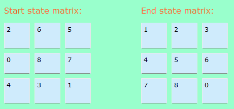

### 3.1. Tìm kiếm không có thông tin
##### Các thành phần chính của bài toán tìm kiếm
Bài toán 8 puzzle có trạng thái ban đầu là ma trận 3×3 chứa 9 chữ số từ 0 đến 8 không trùng lặp (với số 0 đại diện cho ô trống) là đầu vào bài toán cần giải quyết.

Bài toán 8 puzzle có trạng thái mục tiêu cũng là ma trận 3×3 chứa 9 chữ số từ 0 đến 8 không trùng lặp (với số 0 đại diện cho ô trống) là đầu ra của bài toán (là trạng thái muốn có sao khi thực hiện các hành động từ trạng ban đầu).

Hành động:  Các hành động có thể thực hiện từ một trạng thái, bao gồm di chuyển ô trống theo bốn hướng: 'Up', 'Down', 'Left', 'Right'

Tổng chi phí của đường đi từ trạng thái ban đầu đến trạng thái đang xét, thường ký hiệu là g(state) [2, tr. 168]

Giải pháp là một đường đi chứa các trạng thái với trạng thái đầu tiên là trạng thái ban đầu, các trạng thái biến đổi sau khi thực hiện hành động lên trạng thái ban đầu và trạng thái cuối cùng là trạng thái mục tiêu (trạng thái cần tìm).

##### Thuật toán BFS

BFS - Breadth-First Search (Tìm kiếm theo chiều rộng): Khám phá các trạng thái theo mức độ, có thể được dùng khi các hành động có cùng chi phí, đảm bảo tìm được giải pháp ngắn nhất nếu tồn tại giải pháp. Thuật toán này dùng hàng đợi để lưu trữ các trạng thái đang được xét theo nguyên tắc FIFO (vào trước ra trước). Thuật toán kết thúc khi tìm ra lời giải hoặc khi hàng đợi rỗng. [2, tr.175]

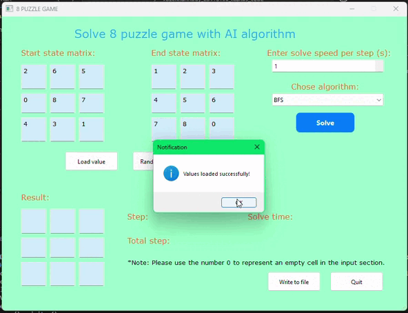

##### Thuật toán DFS

DFS - Depth-First Search (Tìm kiếm theo chiều sâu): Khi các hành động có cùng chi phí có thể áp dụng thuật toán này để Khám phá sâu vào các nhánh trước khi quay lại xét nhánh kế tiếp. Thuật toán có thể tìm ra được lời giải nhưng không đảm bảo tìm được giải pháp tối ưu do có thể phải xét hết tất cả các trạng thái trên nhánh không có lời giải, sau đó mới chuyển sang các nhánh khác.

##### Thuật toán UCS - Uniform Cost Search

UCS - Uniform Cost Search (Tìm kiếm theo chi phí đồng nhất): Mở rộng từ một trạng thái tới trạng thái có chi phí tốt nhất từ trạng thái gốc đến trạng thái đó, đảm bảo tìm được giải pháp tối ưu với chi phí hành trình tìm kiếm là thấp nhất do tính chi phí các nút lân cận và sau đó mới di chuyển đến nút có chi phí tốt nhất.

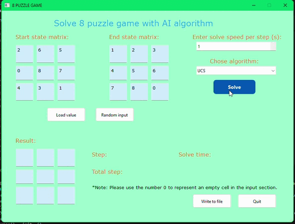

##### Thuật toán IDS

IDS - Iterative Deepening Search (Tìm kiếm sâu dần): Thuật toán này ‘kết hợp ưu điểm của tìm kiếm theo chiều rộng và chiều sâu, thuật toán tìm kiếm theo chiều sâu từ mức thấp đến mức cao hơn, đến khi tìm ra giải pháp’. Đây là lựa chọn tối ưu với “các bài toán tìm kiếm khi không biết trước độ sâu của lời giải”. [3]

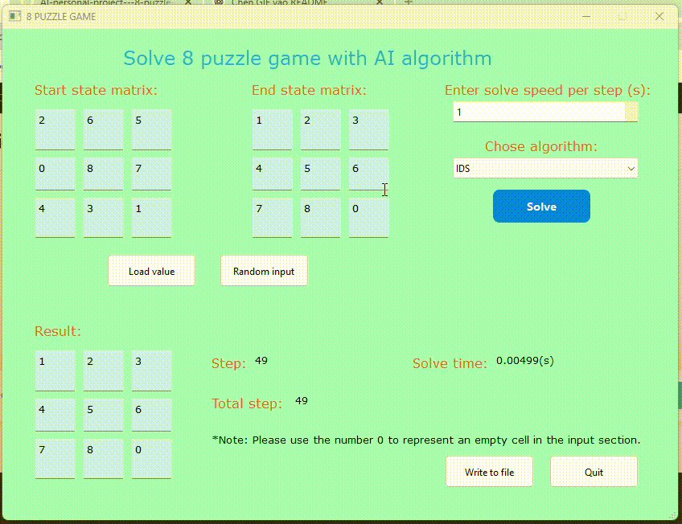

##### Hình ảnh so sánh hiệu suất của các thuật toán

##### Nhận xét về hiệu suất của các thuật toán trong nhóm

Các thuật toán thuộc nhóm tìm kiếm không thông tin tốn nhiều thời gian thực thi do khám phá toàn bộ không gian trạng thái. DFS đặc biệt tốn thời gian trong việc tìm kiếm trạng thái mục tiêu ở xa các nhánh mà thuật toán đang xét dẫn đến DFS duyệt sâu các trạng thái của một nhánh trước khi chuyển sang nhánh khác. IDS có thời gian thấp nhất, là thuật toán nhanh nhất trong 4 thuật toán. UCS có thời gian thực thi cao nhất, là chậm nhất trong nhóm. 

Về số bước thực hiện, các thuật toán thuộc nhóm tìm kiếm không thông tin đều có số bước trong lời giải là ít nhất so với các thuật toán khác. DFS có số bước rất lớn, cho thấy giải pháp của nó không hiệu quả do đi sâu vào các nhánh không chứa lời giải trước. BFS và UCS cho lời giải với số bước ít nhất.

Về số trạng thái đã thăm, IDS là thuật toán thăm ít trạng thái nhất, cho thấy IDS tối ưu nhất về bộ nhớ. DFS tiêu tốn tài nguyên lớn nhất do đi sâu vào các nhánh không chứa lời giải trước dẫn đến chứa nhiều nút cần xét hơn trên cây tìm kiếm.

### 3.2. Tìm kiếm có thông tin
##### Các thành phần chính của bài toán tìm kiếm
Bài toán 8 puzzle có trạng thái ban đầu là ma trận 3×3 chứa 9 chữ số từ 0 đến 8 không trùng lặp (với số 0 đại diện cho ô trống) là đầu vào bài toán cần giải quyết.

Bài toán 8 puzzle có trạng thái mục tiêu cũng là ma trận 3×3 chứa 9 chữ số từ 0 đến 8 không trùng lặp (với số 0 đại diện cho ô trống) là đầu ra của bài toán (là trạng thái muốn có sao khi thực hiện các hành động từ trạng ban đầu).

Hành động: Các hành động có thể thực hiện từ một trạng thái, bao gồm di chuyển ô trống theo bốn hướng: 'Up', 'Down', 'Left', 'Right'

Giải pháp là một đường đi chứa các trạng thái với trạng thái đầu tiên là trạng thái ban đầu, các trạng thái biến đổi sau khi thực hiện hành động lên trạng thái ban đầu và trạng thái cuối cùng là trạng thái mục tiêu (trạng thái cần tìm).

##### Thuật toán Greedy
Greedy Search (Tìm kiếm tham lam - tìm kiếm Greedy): Mở rộng trạng thái tới trạng thái có giá trị hàm heuristic tốt nhất (trong đó, hàm heuristic là hàm đánh giá chi phí từ trạng thái đang xét đến trạng đích).

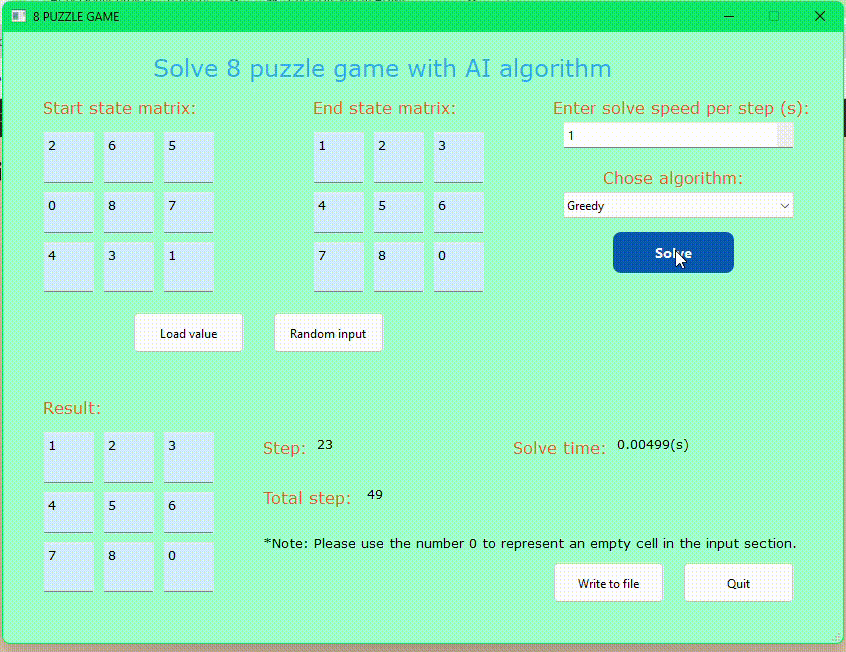

##### Thuật toán A*

A-Star Search (Tìm kiếm A*): Tìm kiếm bằng cách tính chi phí từ trạng thái ban đầu đến trạng thái hiện tại và ước lượng chi phí từ trạng thái hiện tại đến trạng thái mục tiêu để tìm ra trạng thái tiếp theo có chi phí tốt nhất để di chuyển đến.

##### Thuật toán Iterative deepening a*
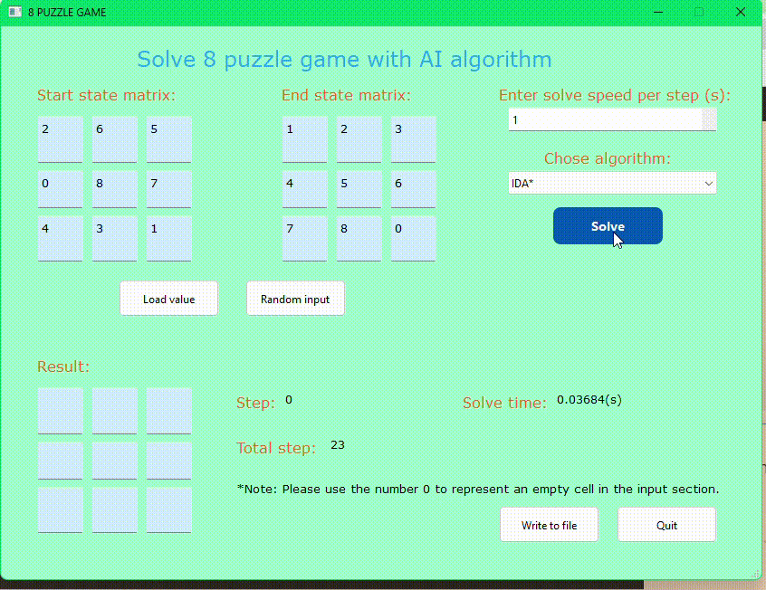

##### Hình ảnh so sánh hiệu suất của các thuật toán

##### Nhận xét về hiệu suất của các thuật toán trong nhóm
Các thuật toán thuộc nhóm tìm kiếm có thông tin thực thi rất nhanh hẳn so với nhóm tìm kiếm không thông tin nhờ sử dụng hàm heuristic để định hướng, tính toán chi phí quá trình tìm kiếm.

Về thời gian tìm lời giải, Greedy có thời gian thực thi nhanh nhất, nhưng đổi lại là lời giải dài hơn. A* tốn nhiều thời gian tìm lời giải nhất, chứng tỏ chi phí tính toán cao hơn. IDA* là phương án trung gian giữa các thuật toán nhóm này: lời giải tốt như A* nhưng thời gian thực thi thấp hơn đáng kể.

Về số bước thực hiện, Greedy có số bước nhiều nhất so với A* và IDA*. Điều này cho thấy A* và IDA* cho lời giải ngắn hơn và tối ưu hơn.

Về số trạng thái đã thăm, Greedy duyệt ít trạng thái hơn nên thăm ít trạng thái nhất, nhưng dễ bị rơi vào cực trị cục bộ do chỉ ưu tiên tìm theo hàm heristic. A* và IDA* xét các trạng thái toàn diện hơn nhưng đánh đổi lại bằng việc mở rộng nhiều trạng thái.

### 3.3. Thuật toán tìm kiếm cục bộ
##### Các thành phần chính của bài toán tìm kiếm
Bài toán 8 puzzle có trạng thái ban đầu là ma trận 3×3 chứa 9 chữ số từ 0 đến 8 không trùng lặp (với số 0 đại diện cho ô trống) là đầu vào bài toán cần giải quyết.

Bài toán 8 puzzle có trạng thái mục tiêu cũng là ma trận 3×3 chứa 9 chữ số từ 0 đến 8 không trùng lặp (với số 0 đại diện cho ô trống) là đầu ra của bài toán (là trạng thái muốn có sao khi thực hiện các hành động từ trạng ban đầu).

Hành động: Các hành động có thể thực hiện từ một trạng thái, bao gồm di chuyển ô trống theo bốn hướng: 'Up', 'Down', 'Left', 'Right'

Giải pháp là một đường đi chứa các trạng thái với trạng thái đầu tiên là trạng thái ban đầu, các trạng thái biến đổi sau khi thực hiện hành động lên trạng thái ban đầu và trạng thái cuối cùng là trạng thái mục tiêu (trạng thái cần tìm).

##### Thuật toán Simple hill climbing
Thuật toán leo đồi đơn giản đánh giá từng trạng thái lân cận một cách tuần tự và chọn trạng thái đầu tiên tối ưu hơn so với trạng thái hiện tại.

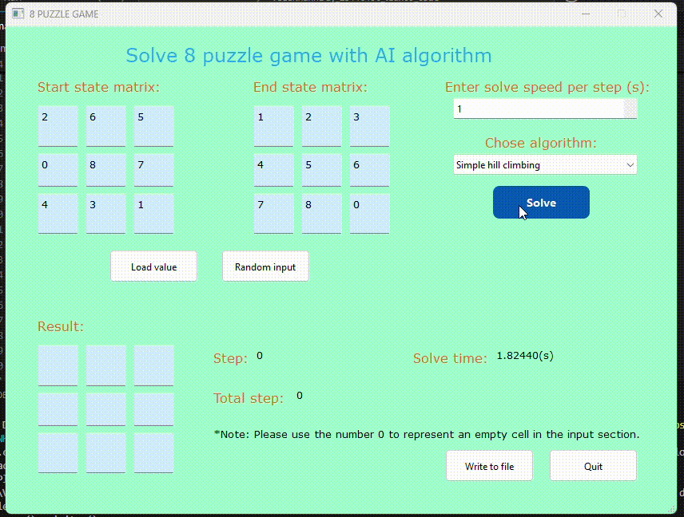

##### Thuật toán Steppest ascent hill climbing
Thuật toán leo đồi dốc nhất đánh giá tất cả các trạng thái lân cận và chọn trạng thái mang lại cải thiện lớn nhất so với trạng thái hiện tại.

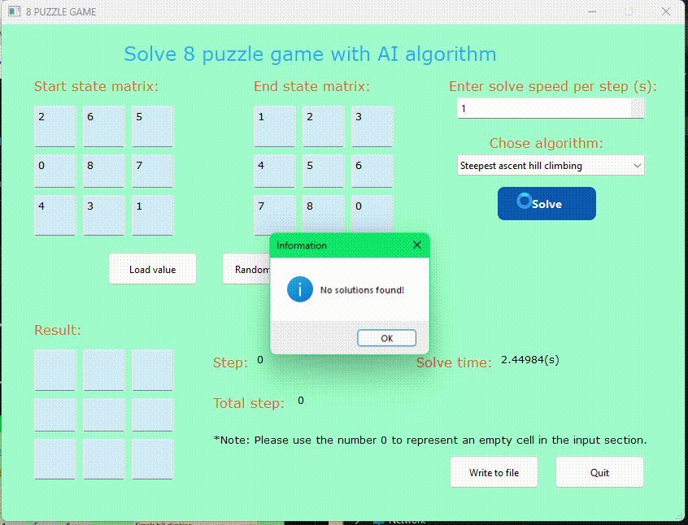

##### Thuật toán Stochastic hill climbing
Thuật toán leo đồi ngẫu nhiên chọn ngẫu nhiên một trạng thái lân cận và quyết định chuyển sang trạng thái đó nếu nó tốt hơn trạng thái hiện tại.

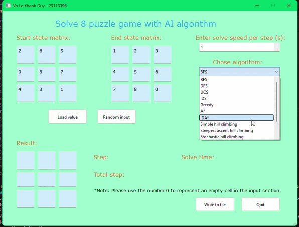

##### Thuật toán Stimulated Annealing
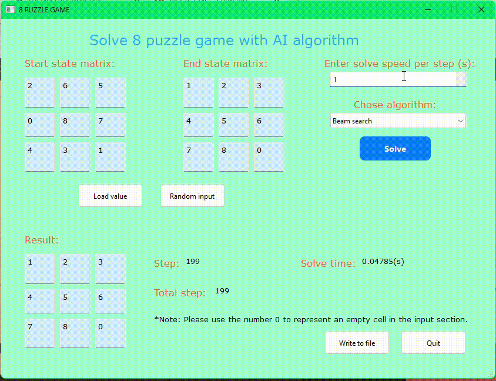

##### Thuật toán Beam Search

##### Thuật toán Genetic Algorithm
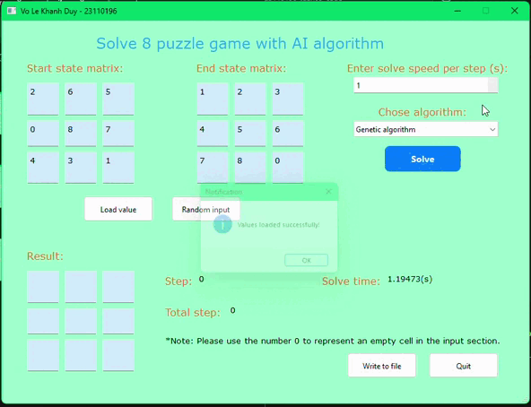

##### Hình ảnh so sánh hiệu suất của các thuật toán

##### Nhận xét về hiệu suất của các thuật toán trong nhóm
Nhìn chung ở nhóm thuật toán này, từ một trạng thái hiện tại đanh xét, quá trình tìm kiếm sẽ mở rộng ra các trạng thái lân cận tốt hơn mà không xét hết cây tìm kiếm. Nhược điểm lớn nhất ở nhóm này là quá trình tìm kiếm dễ mắc kẹt tại cực trị địa phương dẫn đến không tìm ra lời giải.

Về thời gian thực thi, Simple hill climbing, Steepest ascent hill climbing, Stochastic hill climbingcó thời gian thực thi nhanh nhất do chúng thực hiện tìm kiếm với không nhiều lần đánh giá các trạng thái lân cận và không lưu trạng thái mở rộng trong tập mở. Beam Search tốn nhiều thời gian nhất vì thuật toán phải lọc và chọn lựa   2 trạng thái lân cận tốc nhất khiến chi phí xử lý tăng. Simulated Annealing có thời gian thực thi tương đối chậm do phải thực hiện nhiều bước kiểm tra và thử nghiệm các trạng thái có chi phí kém hơn sau khi tính xác suất nhằm tránh rơi vào cực trị địa phương.

Về số bước trong lời giải, ngoại trừ Beam Search, tất cả các thuật toán còn lại đều không tìm ra lời giải (số bước bằng 0) do chúng bị kẹt tại cực trị địa phương, không thoát ra khỏi cấu hình ban đầu do chiến lược tìm kiếm hạn chế. Beam Search tìm được lời giải với 100 bước, chứng tỏ thuật toán này khám phá không gian trạng thái hiệu quả hơn.

### 3.4. Thuật toán tìm kiếm trong môi trường phức tạp
##### Các thành phần chính của bài toán tìm kiếm
Trạng thái ban đầu là một tập các ma trận 3×3 chứa 9 chữ số từ 0 đến 8 không trùng lặp (với số 0 đại diện cho ô trống) là đầu vào bài toán cần giải quyết.

Trạng thái mục tiêu cũng là một tập ma trận 3×3 chứa 9 chữ số từ 0 đến 8 không trùng lặp (với số 0 đại diện cho ô trống) là đầu ra của bài toán (là trạng thái muốn có sao khi thực hiện các hành động từ trạng ban đầu).

Hành động: Các hành động có thể thực hiện từ một trạng thái, bao gồm di chuyển ô trống theo bốn hướng: 'Up', 'Down', 'Left', 'Right'

Giải pháp phép biến đổi tập trạng thái ban đầu thành thành tập trạng thái mục tiêu bằng việc sử dụng một trong các thuật toán của các nhóm phần trên.
##### Thuật toán tìm kiếm AND - OR graph search

##### Thuật toán tìm kiếm không có sự quan sát
(search with no observation)

##### Thuật toán tìm kiếm có sự quan sát một phần
(search with partial observation)

##### Hình ảnh so sánh hiệu suất của các thuật toán

##### Nhận xét về hiệu suất của các thuật toán trong nhóm
Về thời gian thực thi, thuật toán tìm kiếm quan sát một phần (partial observation) có thời gian thực thi ngắn hơn so với không quan sát. Điều này cho thấy rằng việc sử dụng thông tin dù không đầy đủ giúp giảm không gian tìm kiếm do đó tăng tốc độ xử lý và cải thiện thời gian tìm kiếm đáng kể.

Về số bước trong lời giải, hai thuật toán cho kết quả chính xác như nhau về lời giải cuối cùng. Tuy nhiên thực tế khi tăng độ khó ở trạng thái bắt đầu và kết thúc của bài toán thì thuật toán tìm kiếm không quan sát có tỷ lệ không tìm ra lời giải cao hơn vì thuật toán tìm kiếm quan sát một phần sẽ loại bỏ bước trạng thái không phù hợp với trạng thái đích  (do thuật toán này biết độ một số thông tin - cụ thể là một số ô của trạng thái đích) dẫn đến tỷ lệ giải được cao hơn.

Về số trạng thái đã thăm, thuật toán tìm kiếm với quan sát một phần có số lượng trạng thái cần duyệt được giảm ít hơn rõ rệt. Điều này rất quan trọng trong các bài toán như 8 puzzle vốn có không gian trạng thái rất lớn. Việc sử dụng thông tin quan sát giúp giảm chi phí tìm kiếm, hướng thuật toán đến các trạng thái có khả năng là lời giải cao hơn.

### 3.5. Thuật toán tìm kiếm có ràng buộc
##### Các thành phần chính của bài toán tìm kiếm
Tập các biến: Mỗi ô vuông trong bảng 3x3 được xem là một biến. Gọi các biến lần lượt là X1 đến X9 tương ứng với 9 ô cần điền giá trị (giá trị 0 tượng trưng cho ô trống)

Miền giá trị: Mỗi biến Xi có miền giá trị là một số trong tập {0,1,2,3,4,5,6,7,8}

Ràng buộc:

- Tính duy nhất: Mỗi số từ 0 đến 8 chỉ xuất hiện đúng 1 lần trên toàn bộ bảng
- Tính hợp lệ: Số cần điền mỗi ô phải nằm trong miền giá trị của ô
##### Thuật toán kiểm thử

##### Thuật toán backtracking

##### Thuật toán AC3

##### Hình ảnh so sánh hiệu suất của các thuật toán

##### Nhận xét về hiệu suất của các thuật toán trong nhóm
Về thời gian thực thi, AC3 và Backtracking có thời gian thực thi rất thấp, cho thấy chúng sớm tìm ra lời giải. AC3 có thời gian thực thi nhanh nhất do tiến hành lọc miền giá trị bỏ các giá trị không có khả năng dẫn đến lời giải. Thuật toán Test có thời gian thực thi cao đáng kể so với AC3 và Backtracking do thuật toán test thử nghiệm gán ngẫu nhiên giá trị biến sau đó mới kiểm tra ràng buộc.

Về số bước thực hiện trong lời giải, AC3 có ít bước nhất. Tiếp theo là Backtracking. Thuật toán Test thực hiện số bước gấp cao nhất do có nhiều bước tạo ra trạng thái không thỏa lời giải.
### 3.6. Thuật toán tìm kiếm học tăng cường
##### Các thành phần chính của bài toán tìm kiếm
Trạng thái ban đầu là một tập các ma trận 3×3 chứa 9 chữ số từ 0 đến 8 không trùng lặp (với số 0 đại diện cho ô trống) là đầu vào bài toán cần giải quyết.

Trạng thái mục tiêu cũng là một tập ma trận 3×3 chứa 9 chữ số từ 0 đến 8 không trùng lặp (với số 0 đại diện cho ô trống) là đầu ra của bài toán (là trạng thái muốn có sao khi thực hiện các hành động từ trạng ban đầu).

Hành động: Các hành động có thể thực hiện từ một trạng thái, bao gồm di chuyển ô trống theo bốn hướng: 'Up', 'Down', 'Left', 'Right'

Phần thưởng: Giá trị số nhận được sau khi thực hiện một hành động từ một trạng thái.

Bảng Q: Bảng lưu trữ giá trị Q cho mỗi cặp trạng thái - hành động, đại diện cho kỳ vọng phần thưởng khi thực hiện hành động đó từ trạng thái tương ứng.

Tập huấn luyện: Một chuỗi các bước từ trạng thái ban đầu đến khi đạt trạng thái mục tiêu hoặc vượt quá số bước tối đa.
##### Thuật toán tìm kiếm Q Learning

##### Hình ảnh so sánh hiệu suất của các thuật toán

##### Nhận xét về hiệu suất của thuật toán
Reward tăng mạnh trong giai đoạn đầu (khoảng 1000 episode đầu tiên), sau đó duy trì ổn định gần mức tối đa (xấp xỉ 100). Reward tăng đồng nghĩa với việc tác nhân (agent) dần học được cách giải bài toán.

Tỷ lệ thành công tăng từ dưới 20% lên gần 100% trong khoảng 1000-2000 episode. Thuật toán học cách giải đúng puzzle gần như mọi lần sau một số lượng episode huấn luyện nhất định.

Số bước trung bình ban đầu rất cao (trên 17000 bước), sau đó giảm nhanh xuống dưới 1000 bước và dao động quanh mức thấp. Cho thấy tác nhân ban đầu hành động ngẫu nhiên, sau đó dần tối ưu hóa để giải puzzle với ít bước hơn.
## 4. Kết luận
Đa phần các thuật toán AI đã giải quyết tốt bài toán 8 puzzle. Mỗi thuật toán sẽ có ưu, nhược điểm khác nhau về thời gian thực thi, số bước lời giải, số trạng thái thăm và hoàn toàn có thể được kết hợp lẫn nhau để tăng hiệu quả giải quyết bài toán.

Từ bài tập đồ án cá nhân này, ta hoàn toàn có thể áp dụng để giải quyết các thuật toán thực tế khác trong đời sống nhằm cải thiện hiệu quả và chất lượng lời giải.
## 5. Tài liệu tham khảo
[1]. Elastic Platform Team, "Understanding AI search algorithms", elastic, https://www.elastic.co/blog/understanding-ai-search-algorithms, ngày 21 tháng 3 năm 2024 (truy cập ngày 9 tháng 5 năm 2025)

[2]. Stuart Russell and Peter Norvig, "Russell 2020 Artificial intelligence a modern approach", xuất bản lần 4

[3]. "Các thuật toán tìm kiếm: chìa khóa mở cửa trí tuệ nhân tạo", KDATA, https://kdata.vn/tin-tuc/cac-thuat-toan-tim-kiem-chia-khoa-mo-cua-tri-tue-nhan-tao, (truy cập ngày 6 tháng 5 năm 2025)

